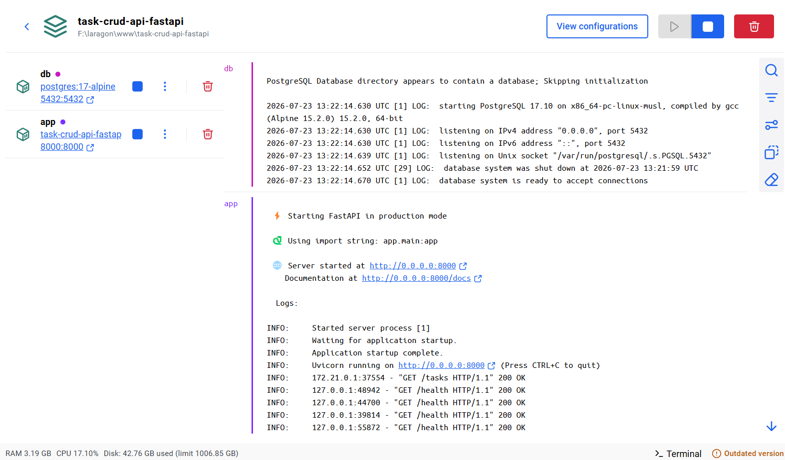
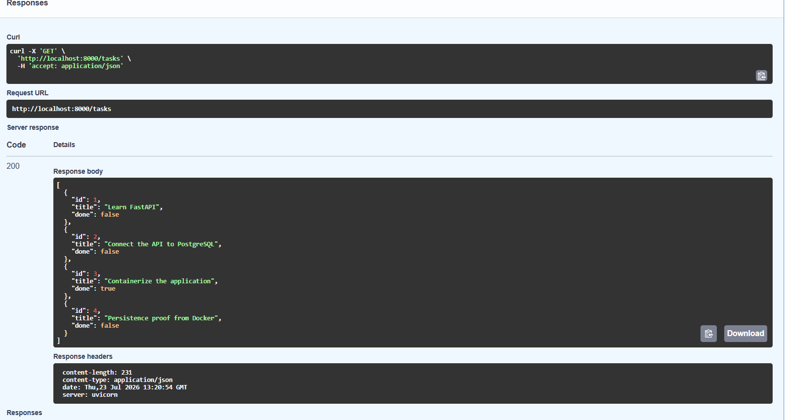

## A3 — Containerized PostgreSQL Stack

Pada Assignment 3, penyimpanan data dipindahkan dari SQLite ke PostgreSQL yang dijalankan melalui Docker.

Seluruh aplikasi dapat dijalankan menggunakan satu perintah:

```bash
docker compose up --build
```

## Architecture

```text
Client
  ↓
FastAPI Routes
  ↓
TaskService
  ↓
TaskRepository Interface
  ↓
PostgresTaskRepository
  ↓
PostgreSQL Docker Container
  ↓
Named Volume
```

## Architecture Note

Versi awal A2 masih mengakses SQLite langsung dari route. Sebelum mengganti penyimpanan ke PostgreSQL, aplikasi terlebih dahulu direfaktor menjadi route, service, dan repository.

Setelah refactor selesai, file route dan service tidak diubah ketika SQLite diganti dengan PostgreSQL. Implementasi baru ditambahkan pada `PostgresTaskRepository`, sedangkan pemilihan repository hanya diubah pada `app/dependencies.py`.

## Environment Configuration

Konfigurasi lokal disimpan di `.env`.

File `.env` tidak dimasukkan ke Git karena dapat berisi password. Contoh konfigurasi tersedia pada `.env.example`.

```env
POSTGRES_DB=tasks_db
POSTGRES_USER=task_user
POSTGRES_PASSWORD=change_this_password
DATABASE_URL=postgresql://task_user:change_this_password@db:5432/tasks_db
```

## Run the Stack

Copy environment example:

```bash
cp .env.example .env
```

Pada Windows PowerShell:

```powershell
Copy-Item .env.example .env
```

Sesuaikan password dan `DATABASE_URL`, kemudian jalankan:

```bash
docker compose up --build
```

Swagger UI:

```text
http://localhost:8000/docs
```

## Services

| Service | Purpose             | Port |
| ------- | ------------------- | ---: |
| `app`   | FastAPI CRUD API    | 8000 |
| `db`    | PostgreSQL database | 5432 |

## Database Initialization

File `sql/init.sql` membuat tabel `tasks` dan memasukkan tiga contoh task ketika PostgreSQL volume dibuat untuk pertama kali.

## Persistence Test

Persistence diuji dengan langkah berikut:

1. Menjalankan stack dengan `docker compose up`.
2. Membuat task melalui `POST /tasks`.
3. Memastikan task tersimpan melalui `GET /tasks`.
4. Menjalankan `docker compose down`.
5. Menjalankan kembali `docker compose up`.
6. Menjalankan `GET /tasks` kembali.

Task yang dibuat sebelum container dihentikan masih tersedia karena data PostgreSQL disimpan pada named volume `postgres_data`.

> `docker compose down -v` tidak digunakan karena opsi `-v` akan menghapus volume database.

## Running Containers



## Persistence Proof


