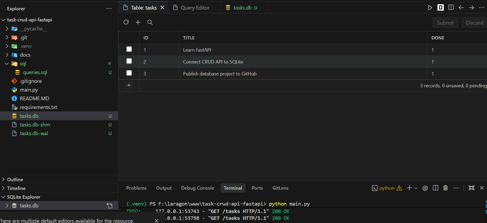
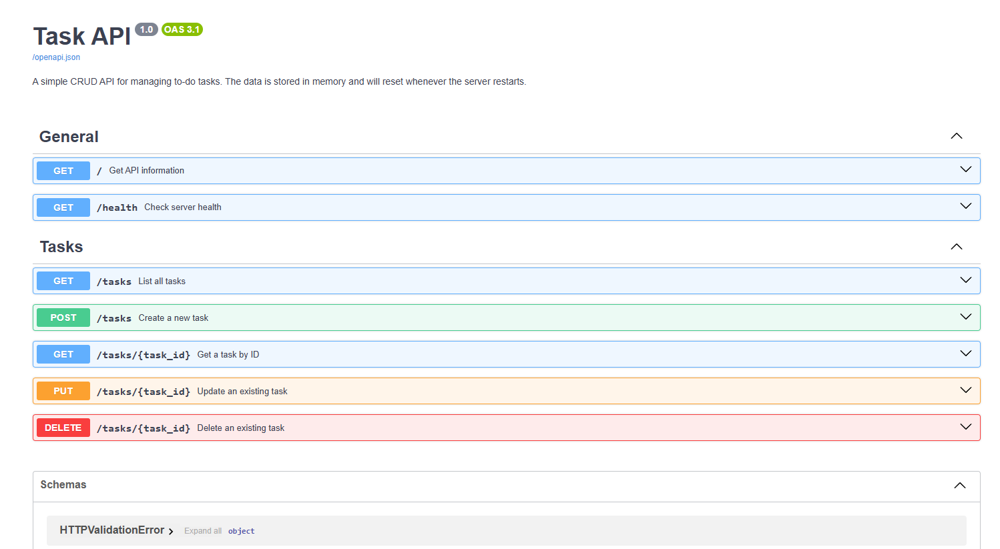

# Task CRUD API with SQLite

Task CRUD API adalah REST API sederhana untuk mengelola daftar tugas menggunakan Python, FastAPI, dan SQLite.

Proyek ini merupakan pengembangan dari versi sebelumnya yang menyimpan data dalam list Python. Pada versi ini, seluruh task disimpan secara permanen di database SQLite sehingga data tetap tersedia setelah server dihentikan atau dijalankan ulang.

## Architecture

```text
Client → FastAPI → SQLite → tasks.db
```

Client tetap menggunakan endpoint dan request body yang sama. Perubahan hanya dilakukan pada bagian penyimpanan data.

## Why SQLite?

SQLite dipilih karena ringan, sederhana, dan tidak memerlukan database server terpisah.

Seluruh database disimpan dalam satu file sehingga cocok digunakan untuk proyek CRUD pertama dan aplikasi lokal berukuran kecil.

## Features

- Create a new task
- Read all tasks
- Read one task
- Update a task
- Delete a task
- Persistent SQLite storage
- Automatic database creation
- Automatic table creation
- Initial data seeding
- Input validation
- JSON error responses
- Swagger UI documentation

## Project Structure

```text
task-crud-api-fastapi/
├── docs/
│   ├── sqlite-viewer.png
│   └── swagger-ui.png
├── sql/
│   └── queries.sql
├── .gitignore
├── main.py
├── README.md
├── requirements.txt
└── tasks.db
```

The `tasks.db` file is created automatically when the application starts and is excluded from Git.

## Database Schema

The application creates a table named `tasks`:

| Column  | Type    | Description                  |
| ------- | ------- | ---------------------------- |
| `id`    | INTEGER | Primary key and automatic ID |
| `title` | TEXT    | Task title                   |
| `done`  | INTEGER | Completion status: 0 or 1    |

SQLite represents boolean values using integers:

```text
0 = false
1 = true
```

## Requirements

- Python 3.10 or newer
- Git

SQLite does not require a separate installation because Python already includes the `sqlite3` module.

## Installation

Clone the repository:

```bash
git clone https://github.com/pramudya-27/task-crud-api-fastapi.git
cd task-crud-api-fastapi
```

Create a virtual environment:

```bash
python -m venv .venv
```

Activate it on Windows PowerShell:

```powershell
.venv\Scripts\Activate.ps1
```

Install the dependencies:

```bash
python -m pip install -r requirements.txt
```

## Run the Application

```bash
fastapi dev main.py
```

The API runs at:

```text
http://127.0.0.1:8000
```

Swagger UI:

```text
http://127.0.0.1:8000/docs
```

The application automatically:

1. Creates `tasks.db` when it does not exist.
2. Creates the `tasks` table when it does not exist.
3. Inserts three example tasks when the table is empty.

## API Endpoints

| Method | Endpoint           | Description         | Success status |
| ------ | ------------------ | ------------------- | -------------: |
| GET    | `/`                | Get API information |            200 |
| GET    | `/health`          | Check server health |            200 |
| GET    | `/tasks`           | List all tasks      |            200 |
| GET    | `/tasks/{task_id}` | Get one task        |            200 |
| POST   | `/tasks`           | Create a task       |            201 |
| PUT    | `/tasks/{task_id}` | Update a task       |            200 |
| DELETE | `/tasks/{task_id}` | Delete a task       |            204 |

## Create a Task

Request:

```bash
curl -i -X POST http://127.0.0.1:8000/tasks \
-H "Content-Type: application/json" \
-d "{\"title\":\"Learn SQLite\"}"
```

Example response:

```text
HTTP/1.1 201 Created
content-type: application/json

{"id":4,"title":"Learn SQLite","done":false}
```

## Update a Task

Request:

```bash
curl -i -X PUT http://127.0.0.1:8000/tasks/4 \
-H "Content-Type: application/json" \
-d "{\"title\":\"Finish SQLite assignment\",\"done\":true}"
```

## Delete a Task

```bash
curl -i -X DELETE http://127.0.0.1:8000/tasks/4
```

A successful deletion returns:

```text
HTTP/1.1 204 No Content
```

## Example SQL Query

The following SQL query returns completed tasks:

```sql
SELECT *
FROM tasks
WHERE done = 1;
```

Additional SQL queries are available in:

```text
sql/queries.sql
```

## SQLite Database Viewer



## Swagger UI



## Persistence Experiment

A new task was created through `POST /tasks`, and then the FastAPI server was stopped and restarted.

After restarting the server, `GET /tasks` still returned the newly created task. This happened because the task was stored inside `tasks.db`, rather than in a temporary Python list.
